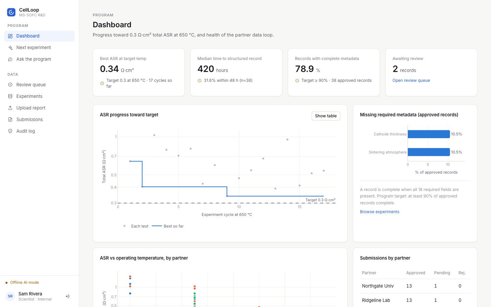
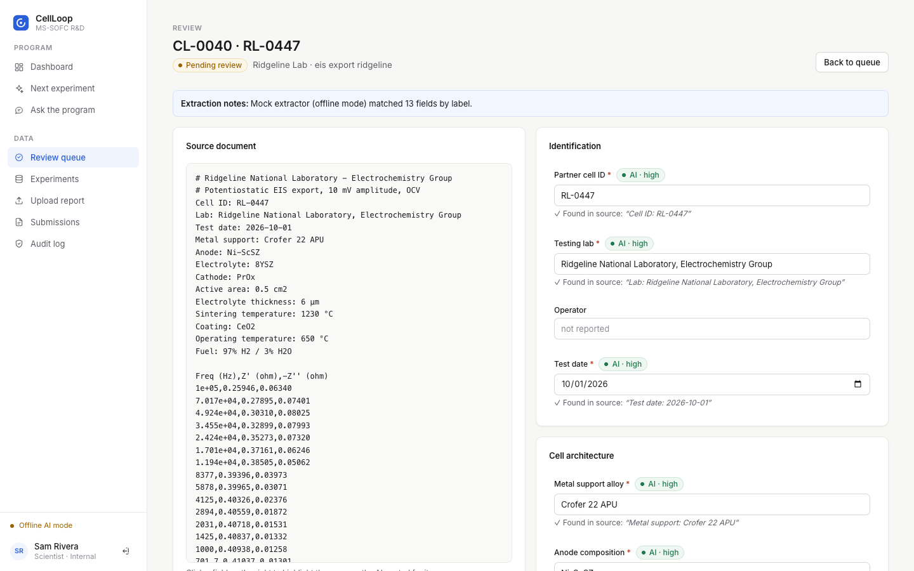
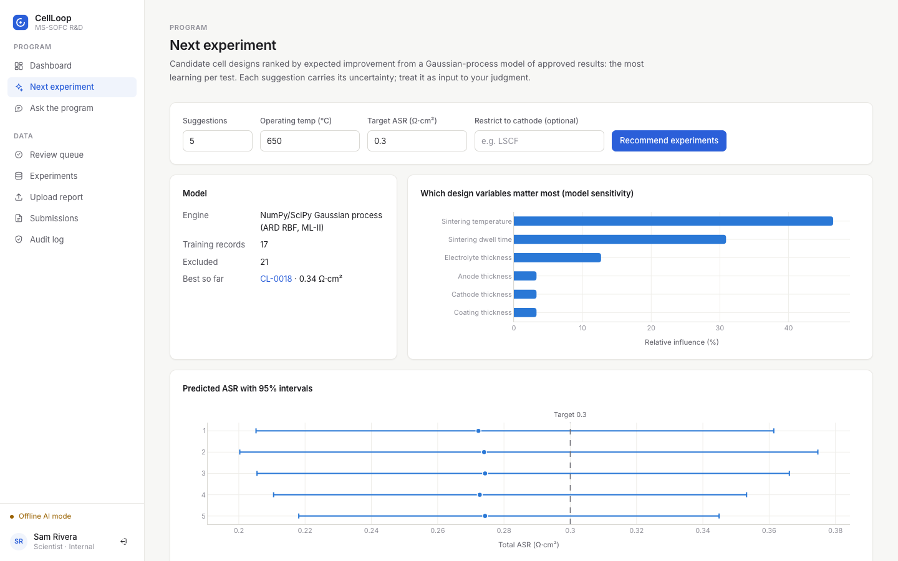

# CellLoop

**The prediction-to-validation loop for metal-supported solid oxide fuel cells (MS-SOFCs).**

CellLoop turns partner-lab test reports into structured, searchable experiment records, recommends
the next experiment with the most learning per test, and answers questions about the program's
history with cited sources. It is built for an R&D team that pairs AI-driven materials modelling
with experimental validation at outside university and national-lab partners.

    



---

## Contents

- [Why CellLoop](#why-cellloop)
- [Features](#features)
- [Quick start](#quick-start)
- [Configuration](#configuration)
- [Project structure](#project-structure)
- [Development](#development)
- [Deployment](#deployment)
- [Error handling](#error-handling)
- [Security and responsible AI](#security-and-responsible-ai)
- [Troubleshooting](#troubleshooting)

## Why CellLoop

Partners email results as spreadsheets, PDFs and raw impedance files. Formats vary, metadata gets lost,
and nobody can quickly answer *"have we tried this before, and what happened?"* Each test takes weeks,
so every duplicated or poorly chosen experiment delays a manufacturable cell.

| Success metric | Target | How CellLoop measures it |
|---|---|---|
| Partner results structured and searchable | within 48 h of submission (from weeks) | Submission → approved-record time, on the dashboard |
| Records with complete metadata | ≥ 90% | Share of approved records with every required field |
| Experiment cycles to target ASR | 25% fewer | Cycles at the target temperature until ASR ≤ target, against a baseline |
| Cross-partner data exposure | zero | Enforced in SQL and retrieval; covered by tests |

## Features

| | Capability | How it works |
|---|---|---|
| 📄 | **AI report extraction** | Claude (via Amazon Bedrock) reads PDFs, spreadsheets and EIS/I-V exports and proposes structured records. Every value carries a verbatim quote from the source, and quotes that aren't in the file are flagged as possible hallucinations. ASR is cross-checked against the raw impedance spectrum. |
| ✅ | **Human review** | Scientists check each field side by side with the source document, with inline validation, confidence badges and evidence highlighting. Nothing becomes a record without approval, and every AI-versus-human change is audited. |
| 🎯 | **Next-experiment recommender** | A Gaussian-process model ranks candidate designs by Expected Improvement (BoTorch, or a built-in NumPy/SciPy GP). Each suggestion shows a 95% interval, its chance of beating the target, the nearest prior test, and a plain-language rationale. |
| 💬 | **Cited Q&A** | Retrieval-augmented answers over approved records and internal reports (pgvector). It answers only with citations and declines when the record has no support. |
| 📊 | **Program dashboard** | ASR progress toward target, turnaround time, metadata completeness, results by partner, and an activity feed. |
| 🔐 | **Role-based access** | Amazon Cognito sign-in. Partners see only their own lab's submissions; the internal team sees everything; leadership has read-only access. |

<table>
  <tr>
    <td width="50%"><br><sub>Review: AI-extracted fields next to the source, with evidence and confidence</sub></td>
    <td width="50%"><br><sub>Recommender: ranked designs with 95% intervals and model sensitivity</sub></td>
  </tr>
</table>

### Tech stack

| Layer | Choice | Why |
|---|---|---|
| Frontend | React 19 + TypeScript (Vite), Tailwind CSS v4, Plotly | Typed schema across dozens of experiment fields; native scientific charts |
| Backend | Python 3.11+, FastAPI, SQLAlchemy 2 | Direct access to NumPy, SciPy, BoTorch and impedance-fitting libraries; automatic API docs |
| Data | PostgreSQL + pgvector (Amazon RDS), S3 with SSE-KMS | One database for structured records and embeddings |
| AI | Claude on Amazon Bedrock (extraction, Q&A), Titan Text Embeddings v2, BoTorch / GP | Proprietary R&D data stays in the company's AWS account and isn't used for training |
| Auth | Amazon Cognito (Hosted UI + PKCE), role groups | Partner, scientist, leadership and admin roles |

## Quick start

**Requirements:** Python 3.11+ and Node.js 20+. Docker and AWS are optional.

```bash
git clone <repo-url> cellloop && cd cellloop
./start.sh          # or: npm start
```

On first run, `start.sh` does the following:

1. Finds a suitable Python and Node, even if nvm isn't loaded in your shell.
2. Creates `backend/.venv` and installs dependencies (about a minute).
3. Creates `backend/.env` from [`backend/.env.example`](backend/.env.example) with a random secret.
4. Seeds a demo database: 6 users, 38 experiments, internal reports and 2 reports awaiting review.
5. Starts the API (`:8000`) and the web app (`:5173`), then opens your browser.

Pick a demo account to sign in:

| Account | Role | Can |
|---|---|---|
| `scientist@cellloop.dev` | Scientist | Review and approve extractions, run the recommender and Q&A |
| `lead@cellloop.dev` | Leadership | View the dashboard, registry, recommender, Q&A and audit log (read-only) |
| `admin@cellloop.dev` | Admin | Everything |
| `researcher@northgate.edu` and two others | Partner | Upload reports; see only their own lab's data |

> Locally, CellLoop runs in **offline AI mode**: a deterministic stand-in replaces Claude, so every screen works
> without AWS credentials. Set `LLM_PROVIDER=bedrock` to use Claude (see [Configuration](#configuration)).

**Try the full loop:** sign in as a partner, upload [`samples/partner_report_northgate.txt`](samples/partner_report_northgate.txt)
(change the cell ID first; identical files are rejected as duplicates). Then sign in as the scientist,
open **Review queue**, verify the fields against the source and approve. The record appears in the
registry, on the dashboard and in Q&A.

Other commands: `./start.sh --reseed` resets the demo data, and **Ctrl+C** stops both servers.
If a port is busy, the script picks the next free one.

## Configuration

All configuration is through environment variables, read from `backend/.env` and `frontend/.env`.
Each example file documents every variable with its default:

| File | Purpose |
|---|---|
| [`backend/.env.example`](backend/.env.example) | API settings: database, auth, storage, AI, program targets |
| [`frontend/.env.example`](frontend/.env.example) | Build-time `VITE_*` settings: API origin, timeouts, Cognito Hosted UI |
| [`.env.example`](.env.example) | Docker Compose: optional ML image, AWS credentials for the container |

The settings you're most likely to change:

| Variable | Default | Description |
|---|---|---|
| `LLM_PROVIDER` | `mock` | `bedrock` uses Claude and Titan on Amazon Bedrock (needs AWS credentials and model access) |
| `DATABASE_URL` | `sqlite:///./cellloop.db` | `postgresql+psycopg://…` for PostgreSQL + pgvector |
| `AUTH_MODE` | `dev` | `cognito` requires `COGNITO_USER_POOL_ID` and `COGNITO_APP_CLIENT_ID` |
| `STORAGE_BACKEND` | `local` | `s3` requires `S3_BUCKET` |
| `APP_ENV` | `dev` | `prod` enforces Cognito, PostgreSQL and S3 |
| `TARGET_ASR_OHM_CM2` / `TARGET_OPERATING_TEMP_C` | `0.30` / `650` | Program targets used by the dashboard and recommender |

Settings are **validated at startup**. A missing or contradictory value stops the server with a readable list:

```
CellLoop configuration error (environment variables / backend/.env):
  • AUTH_MODE=cognito requires COGNITO_USER_POOL_ID and COGNITO_APP_CLIENT_ID

See backend/.env.example for every setting and its allowed values.
```

`VITE_*` values are compiled into the JavaScript bundle and are public, so never put secrets in `frontend/.env`.

## Project structure

```
cellloop/
├── backend/                FastAPI service
│   ├── app/
│   │   ├── core/             config · database · security · access (tenant isolation) · audit · errors · logging
│   │   ├── routers/          HTTP endpoints (auth, documents, experiments, insights)
│   │   ├── services/         parsing · extraction · llm · rag · recommender · impedance · storage
│   │   ├── scripts/          seed (demo data)
│   │   ├── experiment_schema.py   single source of truth for experiment fields
│   │   ├── models.py · serializers.py · main.py
│   ├── tests/              pytest suite
│   └── .env.example
├── frontend/               React + TypeScript SPA
│   └── src/
│       ├── api/  auth/  config/  hooks/  lib/
│       ├── components/       ui/ · charts/ · layout/ · ErrorBoundary
│       ├── pages/            one component per route
│       └── styles/           design tokens (light + dark)
├── db/                     PostgreSQL init (pgvector)
├── docs/                   architecture, AWS deployment, images
├── samples/                example partner report, EIS export, internal reports
├── docker-compose.yml
└── start.sh                one-command local start
```

[`docs/architecture.md`](docs/architecture.md) explains the data flow, the conventions each folder follows, and the error-handling design.

## Development

```bash
# Backend tests: 115, covering access control, workflow, science, errors and security
npm test                                   # or: cd backend && .venv/bin/python -m pytest

# Frontend type-check and production build
cd frontend && npm run typecheck && npm run build
```

| Task | Command |
|---|---|
| Interactive API docs | http://localhost:8000/docs |
| Health check | `curl localhost:8000/api/health` (503 if the database is unreachable) |
| Reset demo data | `npm run reseed` |
| API only | `cd backend && .venv/bin/python -m uvicorn app.main:app --reload --reload-dir app` |
| Web app only | `cd frontend && npm run web` (the API must already be running) |
| Optional ML stack | `backend/.venv/bin/pip install -r backend/requirements-ml.txt` (BoTorch, PyTorch, impedance.py) |

## Deployment

**Docker Compose** (PostgreSQL + pgvector, API, nginx-served web app):

```bash
cp .env.example .env                       # optional: INSTALL_ML, AWS credentials
cp backend/.env.example backend/.env       # adjust settings
docker compose up --build
docker compose exec api python -m app.scripts.seed
# → http://localhost:8080
```

**AWS** (Cognito, RDS with pgvector, S3 with KMS, Bedrock, IAM policy, production checklist):
see [`docs/deployment-aws.md`](docs/deployment-aws.md).

## Error handling

Errors are handled consistently at every layer:

- **API responses** share one shape: `{"detail", "code", "request_id"}`. Every response carries an `X-Request-ID` that matches the server log, and unexpected errors never expose internals.
- **External services:** Bedrock throttling, timeouts and bad credentials, plus S3 and disk failures, become clear, retryable messages. Corrupt uploads mark the document as failed with an explanation.
- **Frontend:** requests have timeouts, network failures are detected, forms validate inline, failures show a Retry button and reference ID, and error boundaries keep one broken page from blanking the app.

The full design is in [`docs/architecture.md`](docs/architecture.md#error-handling).

## Security and responsible AI

- **A human approves every record** the AI extracts. Evidence quotes are verified against the source, and the AI-versus-final diff is audited.
- **Recommendations show uncertainty** (95% intervals and P(beats target)), and their rationales are computed from the model rather than written by an LLM.
- **Q&A cites or declines.** No supporting passage, or no valid citation, means no answer.
- **Zero cross-partner exposure.** Tenant scoping is enforced in SQL and retrieval, out-of-scope IDs return 404, and partner uploads are pinned to the partner's organization.
- **Audit log** of uploads, downloads, AI extractions, edits, approvals, rejections, questions and recommendation runs.
- **Data stays in the AWS account** through Amazon Bedrock. Uploaded documents are treated as untrusted input to the model (prompt-injection hygiene).

The latest test run and security audit (feature inventory, browser tests at three screen sizes, the vulnerabilities fixed, and remaining risks) are in [`docs/testing-and-security.md`](docs/testing-and-security.md).

## Troubleshooting

| Symptom | Fix |
|---|---|
| `npm: command not found` | Node is installed via nvm but not loaded. Run `./start.sh` (it finds Node itself), or add nvm to `~/.zshrc`. |
| `Python 3.11+ not found` | macOS's built-in `python3` is 3.9. Install Python from python.org or Homebrew. |
| `CellLoop configuration error` | Fix the listed variables in `backend/.env`; `backend/.env.example` shows the allowed values. |
| Browser shows "Can't reach the CellLoop API" | The API isn't running. Start everything with `./start.sh` rather than `npm run web`. |
| "Port 8000/5173 is busy" | Another app is using the port; `start.sh` switches to the next free port and prints the URL. |
| "The AI service rejected our credentials" | Check your AWS credentials and that Claude and Titan model access is enabled in Bedrock for `AWS_REGION`. |
| An error message shows a reference ID | Search the API logs for that ID to find the full stack trace. |
